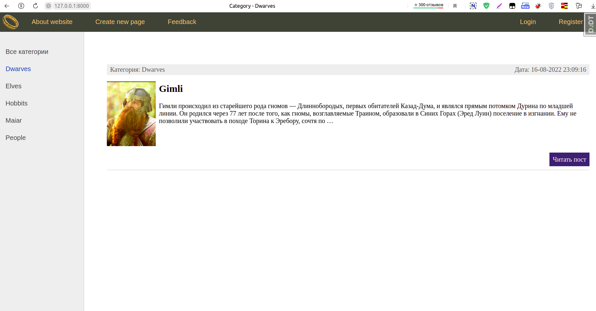
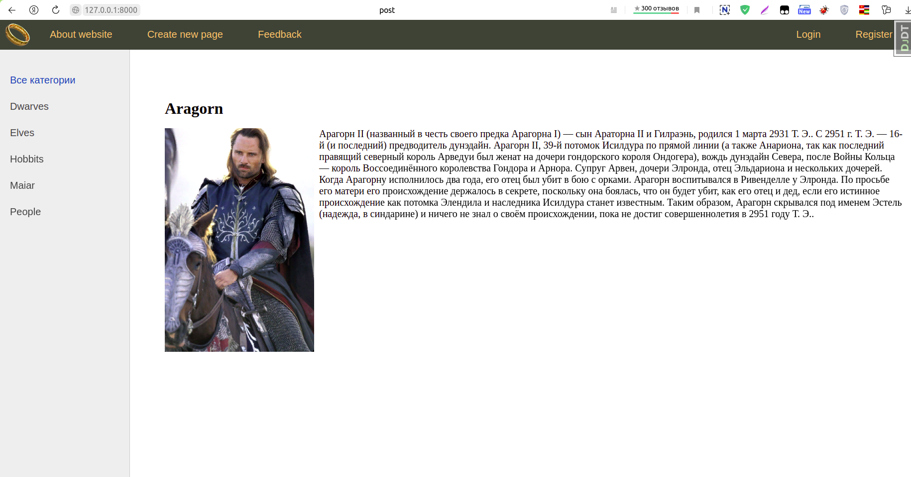
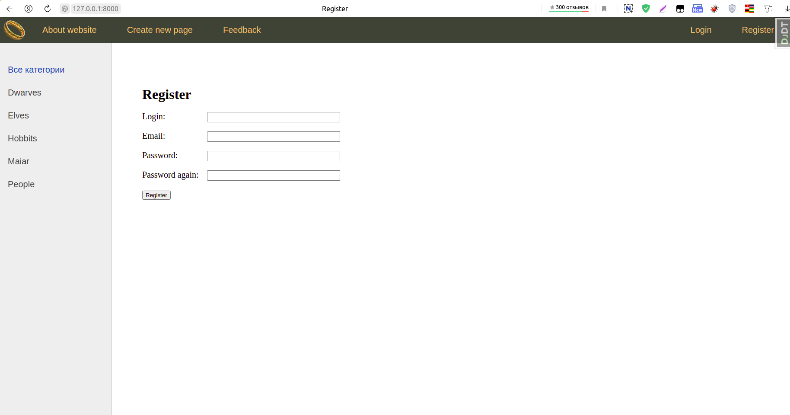

# Middle-earth

- `Python Django`
- to run `python3 manage.py runserver`

## Description
Сайт, посвящённый Средиземью. Представлен список персонажей Средиземья. Можно открыть страницу каждого персонажа. Можно просматривать список всех персонажей, либо список персонажей определённой народности. Есть возможность добавлять новых персонажей и информацию о них, но это воможно только после регистрации.

- Список всех народов

- А тут только гномы. (но он один)

- Страница с информацией об Арагорне!

- Страница регистрации

